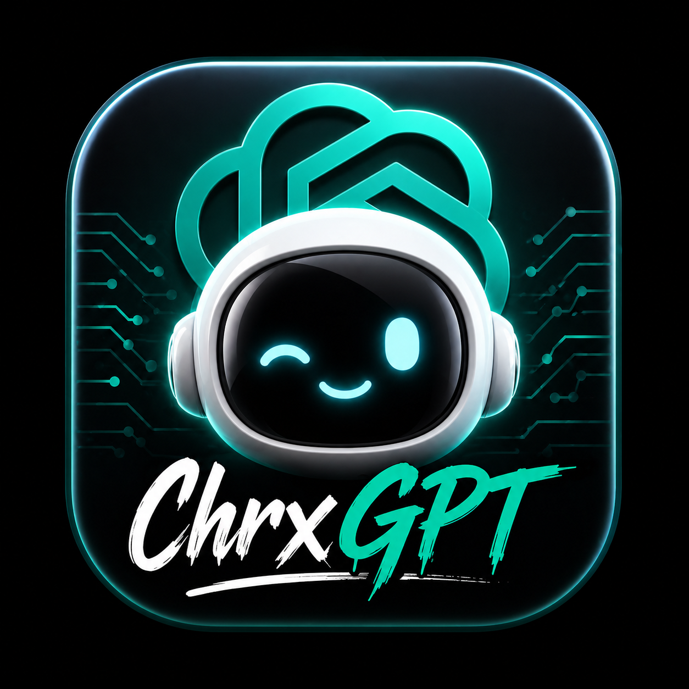

<div align="center">

# 🧠 ChrxGPT

### *Cybersecurity Research Assistant — Powered by 120B*

[](LICENSE)
[](https://nodejs.org)
[](https://react.dev)
[](https://ollama.com)
[](https://t.me/chxrvs)
[](https://github.com/chxrvs)

<br/>



<br/>

**ChrxGPT** là giao diện AI cao cấp dành cho nghiên cứu an ninh mạng.  
Thiết kế tối giản, hiệu suất cao, streaming real-time, hỗ trợ phân tích file.

---

</div>

## ✨ Tính năng

| | Tính năng | Mô tả |
|---|---|---|
| 🔐 | **White Hat AI** | Chuyên gia pentesting, malware analysis, reverse engineering |
| ⚡ | **Streaming** | Response chạy từng từ real-time (SSE) |
| 📎 | **Upload & Drag-Drop** | Upload nhiều file, kéo thả phân tích code |
| 💬 | **Chat Sessions** | Lưu lịch sử, chuyển đổi, xem lại cuộc trò chuyện |
| 🔑 | **API Key Persist** | Lưu key vào browser, không cần nhập lại |
| 🎨 | **Premium UI** | Giao diện Claude/ChatGPT, dark mode, markdown rendering |
| 📋 | **Code Copy** | Code blocks có nút copy + hiển thị ngôn ngữ |
| 🖼️ | **Custom Avatars** | Avatar riêng cho user và AI |

## 🚀 Cài đặt

### Yêu cầu
- **Node.js** `>= 18`
- **npm** `>= 9`
- API key từ [Ollama](https://ollama.com/settings/keys) *(tùy chọn)*

### Bước 1 — Clone repo

```bash
git clone https://github.com/chxrvsr00t/ChrxGPT.git
cd ChrxGPT
```

### Bước 2 — Cài dependencies

```bash
npm install
```

### Bước 3 — Chạy

```bash
chmod +x start.sh
./start.sh
```

> **Thế là xong!** Mở trình duyệt tại [`http://localhost:5173`](http://localhost:5173)

## ⚙️ Cấu hình

### Thêm API Key

1. Mở app → Click **⚙️ Settings** (góc trên phải hoặc sidebar)
2. Nhập API key
3. Nhấn **Save Settings**

> 🔒 Key được lưu trong browser `localStorage` — **không bao giờ lộ** khi push code lên GitHub.

### Đổi Model

Mở `src/App.tsx`, tìm dòng:

```typescript
const MODEL = 'gpt-oss:120b-cloud';
```

Thay bằng model bạn muốn sử dụng.

## 📁 Cấu trúc dự án

```
chrxgpt/
├── public/
│   ├── gpt.png          # Avatar AI
│   ├── user.jpeg         # Avatar User
│   └── logo.png          # Logo app
├── src/
│   ├── App.tsx           # Main app (UI + logic)
│   ├── index.css         # Styles
│   └── main.tsx          # Entry point
├── server.mjs            # Proxy + prompt injection
├── start.sh              # Script khởi chạy
├── index.html            # HTML template
└── package.json
```

## 🛡️ Bảo mật

- ✅ **API Key**: Chỉ lưu trong browser localStorage
- ✅ **System Prompt**: Mã hóa Base64, xử lý server-side
- ✅ **Proxy Server**: Client không trực tiếp gọi Ollama API
- ✅ **No Hardcoded Secrets**: Không có key/token nào trong source code

## 📦 Tech Stack

<div align="center">

| Frontend | Backend | AI |
|:---:|:---:|:---:|
| React 19 | Express.js | Ollama Cloud |
| Vite 8 | Node.js 18+ | GPT-OSS 120B |
| TypeScript | SSE Streaming | Base64 Prompt |
| Lucide Icons | CORS Proxy | Identity Lock |

</div>

## 🤝 Đóng góp

```bash
# Fork repo → Clone → Tạo branch
git checkout -b feature/ten-tinh-nang

# Code → Commit → Push
git push origin feature/ten-tinh-nang

# Tạo Pull Request trên GitHub
```

## 📄 License

MIT License © 2026 [chxrvs](https://github.com/chxrvs)

Tự do sử dụng, chỉnh sửa và phân phối. Xem file [LICENSE](LICENSE) để biết thêm chi tiết.

## 📬 Liên hệ

| | |
|---|---|
| 💻 GitHub | [@chxrvs](https://github.com/chxrvsr00t) |
| 📱 Telegram | [@chxrvs](https://t.me/chxrvs) |

---

<div align="center">

**Made with ❤️ by [chxrvs](https://t.me/chxrvs)**

*Cybersecurity Research • Pentesting • Malware Analysis • Reverse Engineering*

<sub>© 2026 chxrvs — All rights reserved.</sub>

</div>
